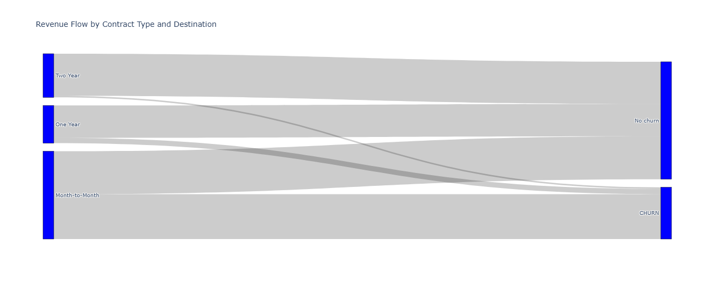
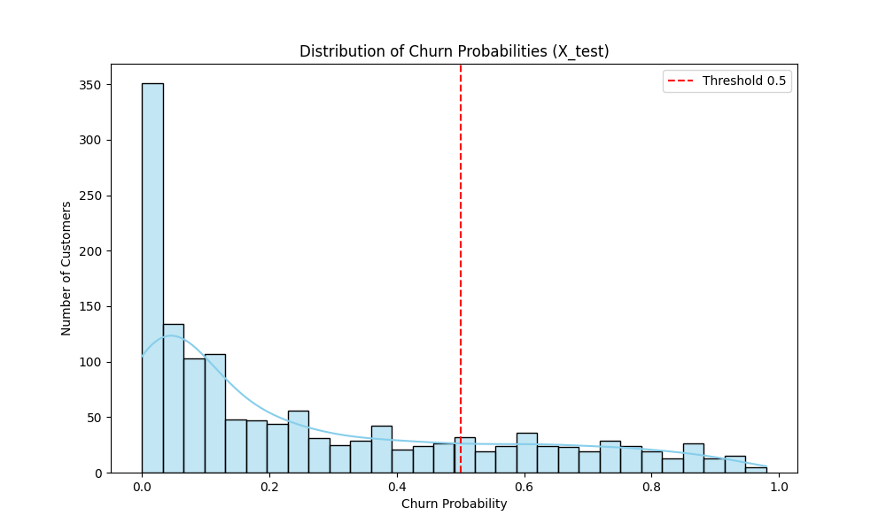
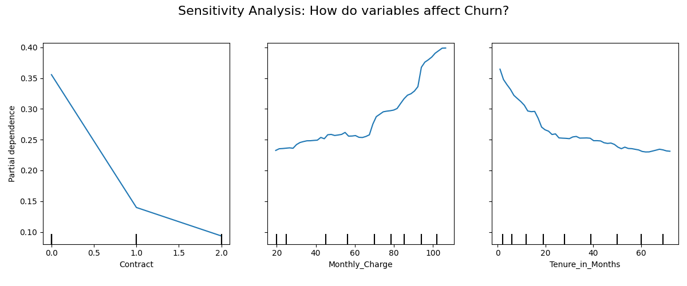
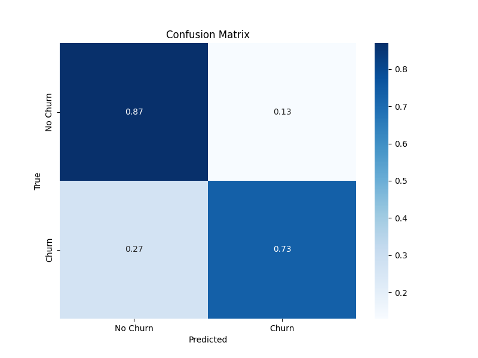
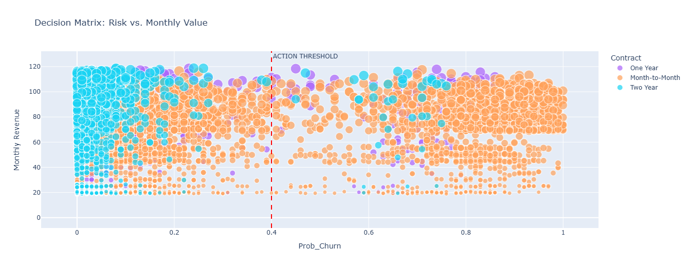
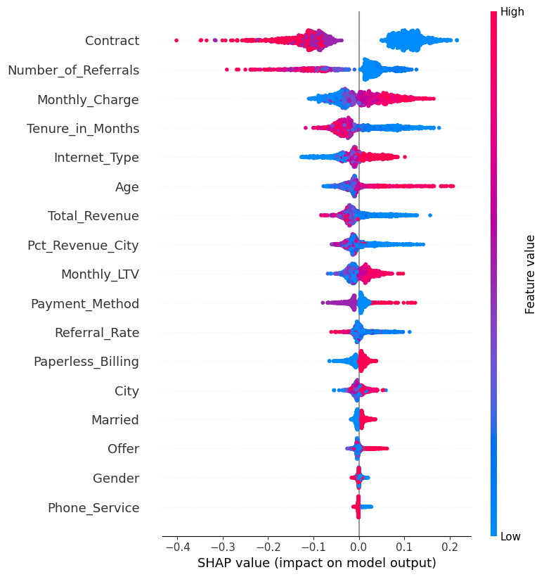
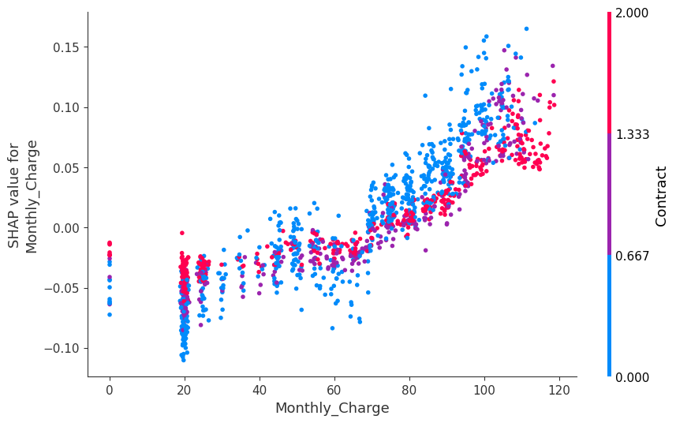

# Churn Shield: Customer Retention System with Quantified ROI

**The business question:** A telecom operator with 7,000+ customers doesn't know which ones are about to leave. Or how much that silence is costing them.

This project answers that question with data and turns the answer into a prioritized retention strategy with measurable ROI.

**Bottom line: €428k net profit from targeting 1,914 at-risk customers. 566% ROI.**

---

## The Problem

Churn isn't a technical problem. It's a revenue leak that accumulates silently.

Most operators react after the customer is gone. The opportunity is to act before — but only on the right customers. Calling everyone is expensive and dilutes impact. Calling no one is worse.

The real challenge: **identify who's leaving, why, and whether the revenue they represent justifies the cost of keeping them.**

---

## Results

| Metric | Value |
|---|---|
| At-risk customers identified | 1,914 |
| Annual revenue at risk | €566,215 |
| Estimated campaign cost | €137,953 |
| **Net profit (566% ROI)** | **€428,262** |

---

## How It Works

### Step 1 — Where Does the Money Leak?

Before any model, understand the structure of the problem. The Sankey diagram makes it immediately visible: **churn concentrates almost entirely on month-to-month contracts.** One-year and two-year customers barely move.



Not a surprise for anyone who's worked in telecom. But quantifying it — and seeing the revenue flow — is what turns intuition into a business case.

---

### Step 2 — SQL Exploration

Before touching ML, I explored the dataset with SQL (CTEs, window functions) directly on the data. Who are these customers? What does their revenue pattern look like? Where are the anomalies?

This phase builds business intuition before the model. A model trained on poorly understood data produces confidently wrong answers.

---

### Step 3 — Model: Random Forest + Threshold Optimization

A Random Forest classifier assigns each customer a churn probability. The result isn't a binary label — it's a spectrum.



Most customers cluster near zero risk. A significant segment sits above 0.4. **The threshold wasn't chosen arbitrarily:** a sensitivity analysis determined the sweet spot where captured revenue justifies campaign cost without inflating false positives.



The confusion matrix confirms the model is calibrated for recall on churners (73% detected) while keeping false alarms controlled (13% false positive rate on loyal customers).



---

### Step 4 — Who to Call First: The Decision Matrix

Every at-risk customer is ranked by churn probability × monthly revenue. The output is a **prioritized action list**, not a prediction.



The vertical line at 0.4 marks the action threshold. Customers to the right and at the top are immediate priority: high value, high risk. Customers to the right and at the bottom are low value. The math doesn't justify the campaign cost.

---

### Step 5 — Explainability: Why Are They Leaving?

A model that says "this customer will churn" without explaining why isn't actionable. SHAP analysis reveals the exact drivers across the entire customer base.



**Contract type, number of referrals, and monthly charges** are the top three factors. Direction matters: long-term contracts and referrals strongly protect against churn. High monthly charges push toward it.

The dependence plot isolates monthly charges: there's a clear risk zone above €70/month, especially for month-to-month customers.



---

## Key Findings

- **Contract type is the strongest churn signal.** Month-to-month customers churn at dramatically higher rates. Retention offers should prioritize migration to longer terms.
- **Monthly charges above €70 create a risk zone.** Price sensitivity spikes at this threshold, particularly combined with month-to-month contracts.
- **Referrals are a protective factor.** Customers who have referred others churn significantly less. Referral programs are underutilized as retention tools.
- **Not all churners are worth retaining.** The decision matrix separates high-value/high-risk customers (immediate action) from low-value/high-risk ones (low priority).

---

## Tech Stack

| Tool | Used For |
|---|---|
| Python / Pandas | Data cleaning and feature engineering |
| SQLite (in-memory) | Exploratory analysis with SQL — CTEs, window functions |
| Scikit-learn | Random Forest, threshold optimization, confusion matrix |
| SHAP | Model explainability and driver analysis |
| Plotly / Matplotlib | Interactive and static strategic visualizations |

---

## Project Structure

```
telecom-churn-prediction-strategy/
├── data/                    # Dataset (Maven Analytics - Telecom Customer Churn)
├── notebooks/               # End-to-end Jupyter Notebook
└── images/                  # High-resolution chart exports
```

---

## About This Project

Built as part of an applied data analysis practice combining domain expertise in telecom (20 years, including 8 years managing a €600M network-sharing agreement between Vodafone and Orange Spain) with hands-on Python and ML skills.

The goal was not to build the most accurate model. It was to build something a business can act on.

*If you work in telecom, financial services, or any subscription-based business and want to talk about how this applies to your context — connect on [LinkedIn](https://www.linkedin.com/in/curro-dominguez/).*
